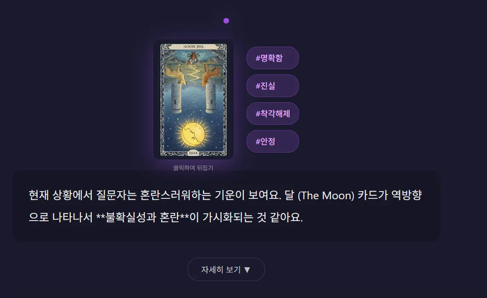

# 🔮 AI 타로 점괘

> 직관적인 UI와 AI 해석이 결합된 온라인 타로 리딩 서비스

---

## ✨ 소개

**AI 타로 점괘**는 전통적인 타로 카드 리딩 경험을 웹에서 구현한 서비스입니다.  
78장의 타로 카드(메이저 아르카나 22장 + 마이너 아르카나 56장)를 활용하여, 사용자의 질문에 맞는 AI 기반 해석을 제공합니다.

🎴 **[지금 바로 타로 보러가기 →](https://tarot-card-app-muwu.onrender.com)**

---

## 🎯 주요 기능

### 📝 자유로운 질문 입력
- 연애, 직장, 재정, 건강 등 어떤 주제든 자유롭게 질문
- AI가 질문을 분석하여 최적의 스프레드(배열) 추천

### 🃏 몰입감 있는 카드 선택
- 78장의 타로 카드 중 직감에 따라 선택
- 3D 플립 애니메이션으로 실제 카드를 뒤집는 듯한 경험
- 정방향/역방향 랜덤 배치

### 🤖 AI 기반 해석
- 선택한 카드와 질문을 종합하여 맞춤형 해석 제공
- 카드별 상세 해석 + 종합 리딩
- 추가 질문을 통한 심층 대화 가능

### 📤 결과 공유
- 링크 복사로 간편 공유
- 이미지 저장 기능

---

## 🛠 기술 스택

| 영역 | 기술 |
|:---:|:---|
| **Frontend** | HTML5, CSS3, Vanilla JavaScript |
| **Backend** | Python, Flask |
| **AI** | Claude API (Anthropic) |
| **Deploy** | Render |

---

## 📱 미리보기

---

## 🌟 특징

- **반응형 디자인** - 모바일, 태블릿, 데스크톱 모두 최적화
- **부드러운 애니메이션** - CSS 애니메이션을 활용한 세련된 UI/UX
- **직관적인 흐름** - 질문 → 카드 선택 → 로딩 → 결과의 명확한 사용자 경험
- **신비로운 분위기** - 타로의 미스터리한 느낌을 살린 다크 테마

---

## 🔗 링크

- 🌐 **서비스**: [https://tarot-card-app-muwu.onrender.com](https://tarot-card-app-muwu.onrender.com)

---

## 📌 참고사항

- 첫 접속 시 서버가 슬립 상태일 경우 로딩에 30초~1분 정도 소요될 수 있습니다 (Render 무료 플랜)
- 타로 해석은 재미와 참고용이며, 중요한 결정은 전문가와 상담하세요 🙏
