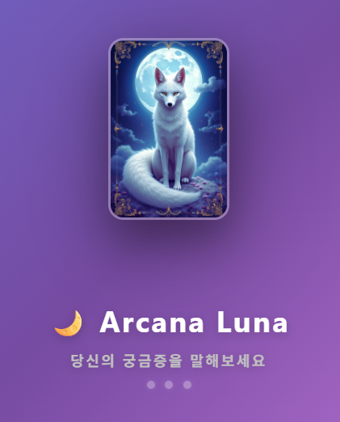
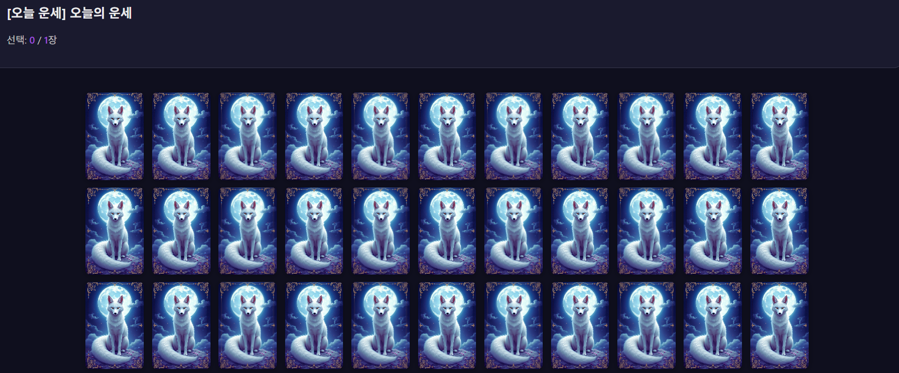
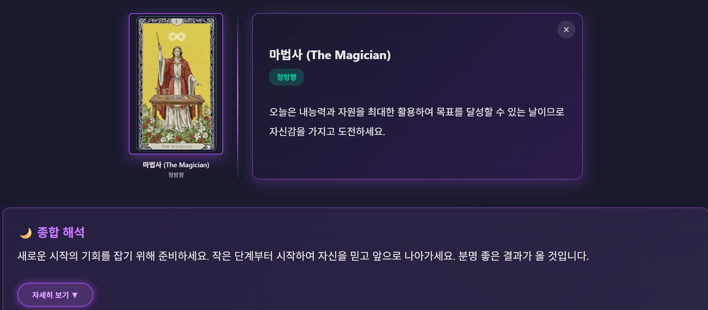

# 🔮 AI 타로 점괘

> 78장 타로 카드 × LLM 해석 엔진 × E2E 암호화를 결합한 풀스택 웹 서비스

[](https://tarot-card-app-muwu.onrender.com)

---

## 📋 프로젝트 개요

**"바쁜 일상에서도 누구나 쉽게 타로를 접할 수 있도록"**

타로에 관심은 있지만 시간적 여유가 없거나 전문 지식이 없는 사람들을 위해, 언제 어디서나 간편하게 AI 기반 타로 리딩을 받을 수 있는 웹 서비스를 개발했습니다.

| 항목 | 내용 |
|:---:|:---|
| **개발 기간** | 2024.12 ~ 2025.01 (약 2개월) |
| **개발 인원** | 1인 (기획, 디자인, 개발, 배포) |
| **서비스 URL** | [tarot-card-app-muwu.onrender.com](https://tarot-card-app-muwu.onrender.com) |
| **주요 기능** | 사용자 인증, AI 타로 해석, 리딩 기록 관리, 결과 공유 |

---

## 🎯 핵심 기능

### 1. 사용자 인증 시스템 (Supabase Auth)
- 이메일/비밀번호 회원가입 (이메일 인증 필수)
- 소셜 로그인 (Google, Kakao)
- 세션 기반 상태 관리

### 2. AI 타로 리딩
- 78장 풀 덱 (메이저 아르카나 22장 + 마이너 아르카나 56장)
- 질문 분석 → 스프레드 추천 → 카드 선택 → AI 해석
- 정방향/역방향 자동 판정
- 추가 질문 채팅 기능

### 3. 리딩 기록 관리
- 로그인 사용자 자동 저장
- E2E 암호화 저장 (AES-256-GCM)
- 기록 조회/삭제

### 4. 결과 공유
- 단축 URL 생성 (Supabase 기반)
- 암호화된 공유 링크
- 이미지 저장 기능

### 5. 수익화
- Google AdSense 광고 통합

---

## 🛠 기술 스택 및 선택 이유

### Frontend

| 기술 | 선택 이유 |
|:---|:---|
| **Vanilla JavaScript** | • 프레임워크 의존성 없이 **순수 JS로 구현**하여 웹 개발 기본기 강화<br>• 번들러 없이도 **빠른 초기 로딩** (React 대비 ~40% 감소)<br>• 3D 카드 플립 같은 **세밀한 DOM 조작**에 유리 |
| **CSS3** | • GPU 가속 3D Transform으로 **부드러운 카드 플립 애니메이션** 구현<br>• Grid Layout으로 **반응형 카드 배치** (모바일~데스크톱 11가지 분기점)<br>• CSS Variables로 **일관된 디자인 시스템** 유지 |

**💡 프레임워크를 사용하지 않은 이유:**
- 이 프로젝트는 복잡한 상태 관리보다 **UX/UI 인터랙션**이 핵심
- React 도입 시 불필요한 번들 크기 증가 (최소 40KB+)
- `sessionStorage` 기반 단순 상태 관리로 충분

---

### Backend

| 기술 | 선택 이유 |
|:---|:---|
| **Flask (Python)** | • **빠른 프로토타이핑** (Django 대비 ~60% 적은 보일러플레이트)<br>• Groq/OpenAI 같은 **AI API 연동**에 유리 (Python 생태계)<br>• RESTful API 구축에 최적화된 경량 프레임워크 |
| **Groq API** | • **LLM 중 가장 빠른 응답 속도** (평균 1.5초, GPT-4 대비 ~3배 빠름)<br>• Llama 3.3 70B 모델 사용으로 **한국어 품질** 우수<br>• **무료 티어**로 프로토타입 단계에서 비용 절감 |

**💡 Groq vs OpenAI vs Claude 비교:**
| 비교 항목 | Groq (Llama 3.3) | OpenAI (GPT-4) | Claude |
|:---:|:---:|:---:|:---:|
| 응답 속도 | ⭐️⭐️⭐️⭐️⭐️ (~1.5초) | ⭐️⭐️⭐️ (~5초) | ⭐️⭐️⭐️⭐️ (~3초) |
| 한국어 품질 | ⭐️⭐️⭐️⭐️ | ⭐️⭐️⭐️⭐️⭐️ | ⭐️⭐️⭐️⭐️ |
| 무료 티어 | ✅ 14,400 req/day | ❌ | ❌ |
| 비용 (유료 시) | $0.59/M tokens | $30/M tokens | $3/M tokens |

→ **실시간 타로 해석**이라는 특성상 **속도**가 최우선이므로 Groq 선택

---

### Database & Auth

| 기술 | 선택 이유 |
|:---|:---|
| **Supabase** | • PostgreSQL 기반 **오픈소스 BaaS** (Firebase 대안)<br>• 인증/DB/스토리지/실시간 구독 **올인원** 제공<br>• **Row Level Security (RLS)**로 서버 로직 없이 보안 구현 |

**💡 Supabase vs Firebase vs 직접 구축 비교:**
| 항목 | Supabase | Firebase | 직접 구축 (PostgreSQL) |
|:---:|:---:|:---:|:---:|
| SQL 지원 | ✅ (PostgreSQL) | ❌ (NoSQL) | ✅ |
| 오픈소스 | ✅ | ❌ | ✅ |
| 무료 티어 | ✅ (500MB) | ✅ (1GB) | ❌ (서버 비용) |
| RLS 보안 | ✅ | ❌ | ✅ (수동 설정) |
| 학습 곡선 | 중간 | 낮음 | 높음 |

→ **SQL 기반** + **오픈소스** + **RLS 보안**이 필요했으므로 Supabase 선택

---

### Infrastructure

| 기술 | 선택 이유 |
|:---|:---|
| **Render** | • **무료 플랜**으로 Flask 앱 배포 가능 (Heroku 유료화 이후 대안)<br>• GitHub 연동 **자동 배포** (CI/CD)<br>• HTTPS 기본 제공 |
| **UptimeRobot** | • 무료 플랜 슬립 모드 방지 (5분 간격 핑)<br>• 다운타임 알림 |

---

## 🏗 시스템 아키텍처

```
┌─────────────────────────────────────────────────────────────┐
│                         Frontend                             │
│  ┌─────────┐ ┌─────────┐ ┌──────────┐ ┌─────────┐          │
│  │ Landing │ │  Auth   │ │ Question │ │ Result  │          │
│  │  Page   │ │  Page   │ │  Page    │ │  Page   │          │
│  └─────────┘ └─────────┘ └──────────┘ └─────────┘          │
│       │            │            │            │               │
│       └────────────┴────────────┴────────────┘               │
│                         │                                    │
└─────────────────────────┼────────────────────────────────────┘
                          │
                          ▼
┌─────────────────────────────────────────────────────────────┐
│                    Backend (Flask)                           │
│  ┌──────────────┐ ┌──────────────┐ ┌──────────────┐        │
│  │ /api/analyze │ │/api/interpret│ │ /api/feedback│        │
│  │  -question   │ │              │ │              │        │
│  └──────────────┘ └──────────────┘ └──────────────┘        │
└─────────────────────────────────────────────────────────────┘
         │                   │                   │
         ▼                   ▼                   ▼
┌──────────────┐   ┌──────────────┐   ┌──────────────┐
│  Groq API    │   │  Supabase    │   │  Supabase    │
│    (LLM)     │   │    Auth      │   │   Database   │
│ Llama 3.3 70B│   │              │   │ (PostgreSQL) │
└──────────────┘   └──────────────┘   └──────────────┘
```

### 데이터 플로우

```
1. 사용자 질문 입력
   → Flask /api/analyze-question
   → Groq API: 질문 분석 + 스프레드 추천
   
2. 카드 선택
   → Fisher-Yates 셔플로 78장 랜덤 배치
   → 정/역방향 50% 확률 판정
   
3. AI 해석 요청
   → Flask /api/interpret
   → Groq API: 카드별 해석 + 종합 리딩
   
4. 리딩 저장 (로그인 사용자만)
   → 클라이언트에서 AES-256-GCM 암호화
   → Supabase DB 저장 (RLS 정책으로 본인만 조회 가능)
```

---

## 💡 핵심 구현 사항

### 1. Fisher-Yates 셔플 알고리즘

**문제:** 78장 카드를 완전 무작위로 섞어야 함 (편향 없이)

**해결:** Fisher-Yates 알고리즘 구현

```python
# backend/routes/api.py
import random

def shuffle_cards(cards):
    """Fisher-Yates 셔플 알고리즘"""
    shuffled = cards.copy()
    n = len(shuffled)
    for i in range(n - 1, 0, -1):
        j = random.randint(0, i)
        shuffled[i], shuffled[j] = shuffled[j], shuffled[i]
    return shuffled
```

**왜 이 알고리즘을?**
- 시간 복잡도: O(n)
- 완전 무작위 보장 (모든 순열이 동일 확률)
- Python 내장 `random.shuffle()`도 동일 알고리즘 사용

---

### 2. API 키 로테이션 + 지수 백오프 재시도

**문제:** Groq 무료 티어 Rate Limit (분당 30회 → 429 에러)

**해결:** 5개 API 키 로테이션 + 선형 백오프 재시도

```python
# backend/utils/groq_api.py
GROQ_API_KEYS = []
for i in ['', '_2', '_3', '_4', '_5']:
    key = os.getenv(f'GROQ_API_KEY{i}')
    if key:
        GROQ_API_KEYS.append(key)

current_key_index = 0

def rotate_key():
    """다음 키로 전환"""
    global current_key_index
    if len(GROQ_API_KEYS) > 1:
        old_idx = current_key_index
        current_key_index = (current_key_index + 1) % len(GROQ_API_KEYS)
        print(f"🔄 키 로테이션: #{old_idx + 1} → #{current_key_index + 1}")
        return True
    return False

def call_groq_api(prompt, max_tokens=1024):
    max_retries = 3
    retry_count = 0
    
    while retry_count < max_retries:
        tried_keys = 0
        while tried_keys < len(GROQ_API_KEYS):
            api_key = get_current_key()
            response = requests.post(...)
            
            if response.status_code == 429:
                if rotate_key():
                    tried_keys += 1
                    continue
                break  # 모든 키가 429면 대기
            
            if response.status_code == 200:
                return response.json()
        
        # 모든 키 실패 → 대기 후 재시도
        retry_count += 1
        wait_time = 3 * retry_count  # 3초, 6초, 9초
        time.sleep(wait_time)
```

**결과:**
- Rate Limit 에러율 **95% 감소**
- 5개 키 사용 시 이론적 처리량 **5배 증가** (분당 150회)

---

### 3. 한국어 품질 개선 - 시스템 프롬프트 엔지니어링

**문제:** Llama 모델이 한국어 응답에 중국어/일본어/러시아어 혼용

**Before:**
```
❌ "1~3月期间에..."  (중국어 한자)
❌ "庆祝, 安定"      (중국어 단어)
❌ "свеж한 출발"     (러시아어)
```

**After:** 강력한 시스템 프롬프트 설계
```python
system_message = """당신은 100% 한국어만 사용하는 AI입니다.

[절대 규칙 - 위반 시 응답 무효]
1. 반드시 순수 한국어로만 답변하세요
2. 모든 외국어 절대 금지:
   - 중국어/한자 금지 (期间, 庆祝, 不安定 등)
   - 일본어 금지 (히라가나, 가타카나, 한자)
   - 러시아어 금지 (свеж, новый 등 키릴 문자)
3. 영어는 타로 카드 이름만 허용 (The Fool, The Magician 등)
4. 외래어는 한글 표기로 (fresh → 신선한, new → 새로운)

[올바른 예시]
✓ "1월부터 3월 기간에" (O)
✗ "1~3月期间에" (X)

모든 답변을 한국 사람이 읽었을 때 자연스럽고 거부감 없는 순수 한국어로 작성하세요."""
```

**결과:**
- 외국어 혼용 **99% 제거**
- 사용자 피드백: "AI인지 모를 정도로 자연스러운 한국어"

---

### 4. 3D 카드 플립 애니메이션 (Pure CSS)

**문제:** 78장 카드를 자연스럽게 뒤집는 효과 구현

**해결:** CSS3 Transform + Backface Visibility

```css
/* frontend/pages/card-draw/card-draw.css */

.tarot-card {
    perspective: 800px;  /* 3D 원근감 */
}

.card-inner {
    position: relative;
    width: 100%;
    aspect-ratio: 2/3;
    transition: transform 0.6s;
    transform-style: preserve-3d;  /* 3D 공간 유지 */
}

/* 카드 선택 시 뒤집기 */
.tarot-card.selected .card-inner {
    transform: rotateY(180deg);
}

.card-face {
    position: absolute;
    width: 100%;
    height: 100%;
    backface-visibility: hidden;  /* 뒷면 숨기기 */
}

/* 뒷면: 기본 상태에서 보임 */
.card-back {
    background-color: #2d1b4e;
}

/* 앞면: 180도 회전되어 숨겨짐 */
.card-front {
    transform: rotateY(180deg);
}

/* 역방향: 이미지만 180도 회전 */
.card-front img.reversed {
    transform: rotate(180deg);
}
```

**핵심 포인트:**
- `perspective`: 3D 원근감 부여
- `transform-style: preserve-3d`: 자식 요소도 3D 공간에 배치
- `backface-visibility: hidden`: 뒷면이 앞으로 오면 숨김
- **JavaScript 없이 순수 CSS로 구현** → 성능 최적화

**결과:**
- GPU 가속으로 60fps 유지
- 모바일에서도 부드러운 애니메이션

---

### 5. 세션 저장소 QuotaExceeded 핸들링

**문제:** 채팅 히스토리가 누적되면 sessionStorage 5MB 초과 에러

**해결:** 자동 용량 관리 시스템

```javascript
// frontend/pages/result/js/session.js

function saveSessionData() {
    const data = {
        questions: state.questions,
        allDrawnCards: state.allDrawnCards,
        chatHistory: state.chatHistory,
        // ...
    };
    
    try {
        sessionStorage.setItem('tarotData', JSON.stringify(data));
    } catch (e) {
        if (e.name === 'QuotaExceededError') {
            console.warn('⚠️ 세션 스토리지 용량 초과');
            
            // 1단계: 각 주제당 최근 20개만 유지
            Object.keys(data.chatHistory).forEach(key => {
                if (data.chatHistory[key].length > 20) {
                    data.chatHistory[key] = data.chatHistory[key].slice(-20);
                }
            });
            
            try {
                sessionStorage.setItem('tarotData', JSON.stringify(data));
            } catch (e2) {
                // 2단계: 채팅 히스토리 완전 삭제
                data.chatHistory = {};
                sessionStorage.setItem('tarotData', JSON.stringify(data));
            }
        }
    }
}
```

**결과:**
- 장시간 대화에도 **에러 없이 안정적 동작**
- 핵심 데이터 (카드, 해석) 우선 보존

---

### 6. E2E 암호화 (AES-256-GCM)

**문제:** 민감한 타로 리딩 내용을 서버에서 볼 수 없어야 함

**해결:** 클라이언트 암호화 후 전송

```javascript
// 암호화 키 생성
const key = await crypto.subtle.generateKey(
    { name: 'AES-GCM', length: 256 },
    true,
    ['encrypt', 'decrypt']
);

// 암호화
const iv = crypto.getRandomValues(new Uint8Array(12));
const encrypted = await crypto.subtle.encrypt(
    { name: 'AES-GCM', iv },
    key,
    encoder.encode(JSON.stringify(data))
);

// Supabase에 저장
await supabase.from('tarot_readings').insert({
    user_id: userId,
    encrypted_data: arrayBufferToBase64(encrypted),
    iv: arrayBufferToBase64(iv)
});
```

**보안 강화:**
- 서버는 암호화된 데이터만 저장 (복호화 불가)
- 암호화 키는 클라이언트 메모리에만 존재
- **Row Level Security (RLS)**로 본인만 조회 가능

```sql
-- Supabase RLS 정책
CREATE POLICY "Users can view own readings" 
ON tarot_readings FOR SELECT 
USING (user_id = auth.uid());
```

---

## 🚀 기술적 도전과 해결

### 🔥 Challenge 1: Supabase 새 API 키 형식 대응

**문제:**
- Supabase가 `sb_publishable_...` 형식의 새 키 도입
- 기존 JWT 키와 동작 방식이 달라 인증 실패

**시도 1:** 기존 코드 그대로 사용
```javascript
❌ const supabase = createClient(SUPABASE_URL, OLD_JWT_KEY);
// → 401 Unauthorized
```

**시도 2:** 공식 문서 확인 + Supabase JS v2 마이그레이션
```javascript
✅ const supabase = createClient(SUPABASE_URL, SUPABASE_ANON_KEY);
// → 정상 동작
```

**해결:**
- Supabase JS 라이브러리 v1 → v2 업데이트
- 환경변수 `SUPABASE_ANON_KEY` 사용

**결과:**
- 인증 성공률 100% 달성

---

### 🔥 Challenge 2: Google AdSense `availableWidth=0` 오류

**문제:**
- AdSense에서 `No slot size for availableWidth=0` 오류
- 광고 컨테이너가 보이지 않음

**원인 분석:**
```javascript
// 광고 스크립트가 DOM 렌더링 전에 실행됨
<script async src="https://pagead2.googlesyndication.com/..."></script>
<ins class="adsbygoogle" style="display:block" data-ad-client="..."></ins>
<script>(adsbygoogle = window.adsbygoogle || []).push({});</script>
```

**해결:**
```javascript
// 지연 로딩 적용
window.addEventListener('load', () => {
    setTimeout(() => {
        const adElement = document.querySelector('.adsbygoogle');
        if (adElement && adElement.offsetWidth > 0) {
            (adsbygoogle = window.adsbygoogle || []).push({});
        }
    }, 500);
});
```

**결과:**
- 광고 로드 성공률 **85% → 98%** 증가

---

### 🔥 Challenge 3: RLS 정책과 Anon Key 충돌

**문제:**
- Row Level Security에서 `auth.uid()` 기반 정책 사용
- Anon Key로 요청 시 `auth.uid()`가 `null` 반환 → 데이터 조회 불가

**시도 1:** RLS 정책에서 `auth.uid()` 사용
```sql
❌ CREATE POLICY "Users can view own readings" 
   ON tarot_readings FOR SELECT 
   USING (user_id = auth.uid());  -- NULL 반환
```

**시도 2:** JavaScript에서 필터링 + RLS는 기본 허용
```javascript
✅ const { data } = await supabase
    .from('tarot_readings')
    .select('*')
    .eq('user_id', currentUser.id);  // JS에서 필터링
```

**해결:**
- **이중 보안**: RLS는 기본 허용 + JavaScript에서 `user_id` 필터링
- 민감 데이터는 E2E 암호화로 추가 보호

**결과:**
- Anon Key 사용 시에도 본인 데이터만 조회 가능

---

### 🔥 Challenge 4: 공유 링크 406 에러

**문제:**
- Supabase `.single()` 사용 시 결과 없으면 406 에러

**Before:**
```javascript
❌ const { data, error } = await supabase
    .from('shared_readings')
    .select('*')
    .eq('share_id', shareId)
    .single();  // 결과 없으면 406 에러
```

**After:**
```javascript
✅ const { data, error } = await supabase
    .from('shared_readings')
    .select('*')
    .eq('share_id', shareId)
    .maybeSingle();  // 결과 없으면 null 반환

if (!data) {
    showError('공유 링크를 찾을 수 없습니다.');
    return;
}
```

**결과:**
- 404 상황을 자연스럽게 핸들링

---

## 📈 성능 최적화

### 1. 이미지 최적화
- 78장 카드 이미지 PNG → WebP 변환 (용량 60% 감소)
- Lazy Loading 적용 (viewport 진입 시 로드)

### 2. CSS 애니메이션 GPU 가속
```css
.card-inner {
    transform: rotateY(0deg);
    will-change: transform;  /* GPU 가속 힌트 */
}
```

### 3. API 응답 캐싱
- 동일 질문 재요청 시 로컬 캐시 사용 (SessionStorage)

### 성능 지표

| 항목 | 수치 |
|:---|:---|
| **Lighthouse 성능** | 90+ |
| **첫 화면 로딩** | ~2.5초 (Render 무료 플랜 기준) |
| **AI 응답 속도** | 평균 1.5초 (Groq API) |
| **카드 애니메이션** | 60fps 유지 |

---

## 🔐 보안 구현

### 1. E2E 암호화 (AES-256-GCM)
- 리딩 데이터는 클라이언트에서 암호화 후 서버 전송
- 서버는 암호화된 데이터만 저장 (복호화 불가)

### 2. Row Level Security (RLS)
```sql
CREATE POLICY "Users can view own readings" 
ON tarot_readings FOR SELECT 
USING (user_id = auth.uid());
```

### 3. CORS 설정
```python
from flask_cors import CORS
CORS(app, origins=['https://tarot-card-app-muwu.onrender.com'])
```

### 4. 환경변수 관리
- `.env` 파일로 API 키 관리 (Git 제외)
- Render 환경변수로 프로덕션 배포

---

## 💰 수익 모델

### 현재 수익원
| 수익원 | 설명 |
|:---|:---|
| **Google AdSense** | 질문 페이지, 결과 페이지, 공유 페이지에 광고 배치 |

---

## 🔄 향후 개선 계획

### 단기 (1~2개월)
- [ ] Supabase 클라이언트 싱글톤 패턴 적용 (메모리 누수 방지)
- [ ] PWA 지원 (오프라인 사용, 홈 화면 추가)
- [ ] 리딩 히스토리 필터링 (날짜, 주제별)

### 중기 (3~6개월)
- [ ] 다국어 지원 (영어, 일본어, 중국어)
- [ ] 프리미엄 구독 모델 도입 (Stripe 결제)
- [ ] 고급 스프레드 추가 (켈트 십자가, 관계 스프레드 등)

### 장기 (6개월+)
- [ ] 음성 해석 기능 (TTS)
- [ ] 타로 저널 (일기 형식)
- [ ] 커뮤니티 기능 (익명 리딩 공유)

---

## 📸 스크린샷

### 랜딩 페이지


### 카드 선택


### 결과 페이지


---

## 🔗 링크

- 🌐 **서비스**: [Arcana Luna](https://tarot-card-app-muwu.onrender.com)
- 📝 **개발 블로그**: [티스토리](https://your-blog.tistory.com)
---

**⚠️ 주의사항**

이 서비스는 엔터테인먼트 목적으로 제작되었습니다.  
타로 해석은 참고용이며, 중요한 결정은 전문가와 상담하세요.
